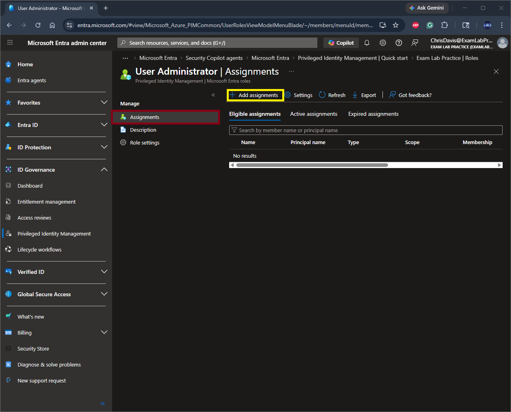
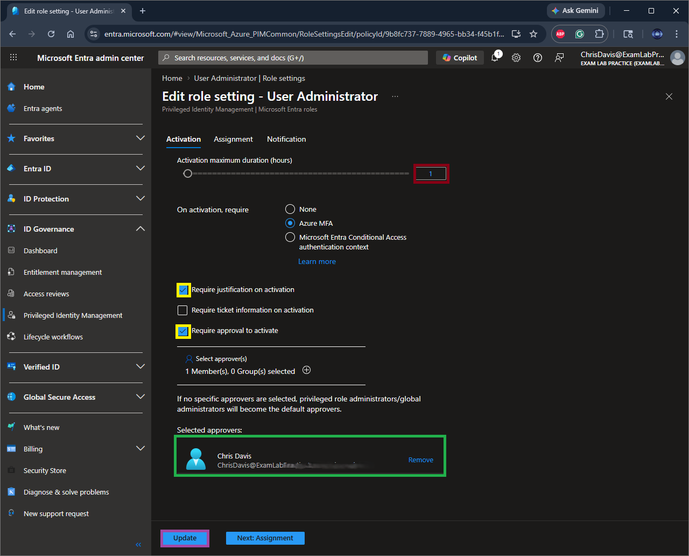
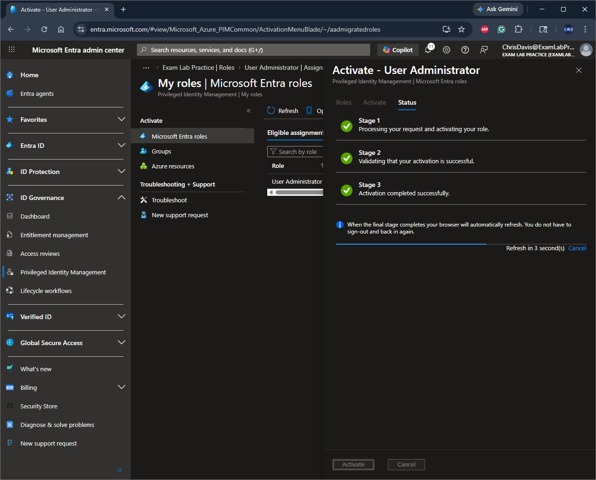

# 🔐 Privileged Identity Management (PIM) Implementation – Microsoft Entra ID

## 📌 Overview

This lab demonstrates the implementation of **Privileged Identity Management (PIM)** in Microsoft Entra ID to enforce:

* Least privilege access
* Just-in-Time (JIT) role activation
* Privileged access governance

---

## 🎯 Objectives

* Configure eligible role assignments
* Enable Just-in-Time (JIT) access
* Reduce standing privileges
* Implement approval-based role activation
* Track and audit privileged access

---

## 🏗️ Environment

* Microsoft Entra ID (P2 License)
* Test User: Chris Davis
* Role: User Administrator

---

## ⚙️ Implementation Steps

### 1. Navigate to PIM

Microsoft Entra Admin Center → Identity Governance → Privileged Identity Management

---

### 2. Assign Eligible Role

* Selected **User Administrator**
* Assignment Type: **Eligible**
* Scope: **Directory**

---

### 3. Configure Assignment Settings

* Enabled **Permanently Eligible**
* Configured assignment duration

---

### 4. Configure Role Settings (Security Controls)

* Required **Azure MFA**
* Required **justification on activation**
* Required **approval to activate**
* Set **activation duration limits**

---

### 5. Activate Role (JIT)

* Navigated to **My Roles**
* Selected **User Administrator**
* Clicked **Activate**

---

### 6. Validate Activation

* Role transitioned from **Eligible → Active**
* Verified time-bound activation

---

## 🔍 Key Security Benefits

* Eliminates permanent admin access
* Reduces attack surface
* Supports Zero Trust principles
* Enables audit and compliance tracking
* Prevents privilege creep

---

## ⚠️ Lessons Learned

* Approval workflows can block activation if misconfigured
* Time-bound assignments must align with policy limits
* Global Administrator roles must be tightly controlled to avoid lockout
* Always maintain a **break-glass account**

---

## 🧠 Real-World Application

In enterprise environments, PIM is used to:

* Enforce least privilege access
* Provide temporary elevated access for administrators
* Meet compliance requirements (SOC 2, ISO 27001, NIST)
* Monitor privileged account activity

---

## 📎 Author

Chris Davis
Cloud Security Engineer | IAM | Zero Trust
# 🔐 Privileged Identity Management (PIM) Implementation – Microsoft Entra ID

## 📌 Overview
This lab demonstrates the implementation of Privileged Identity Management (PIM) in Microsoft Entra ID to enforce **least privilege access**, **Just-in-Time (JIT) role activation**, and **privileged access governance**.

---

## 🎯 Objectives
- Configure **eligible role assignments**
- Enable **Just-in-Time (JIT) access**
- Reduce **standing privileges**
- Implement **approval-based role activation**
- Track and audit privileged access

---

## 🏗️ Environment
- Microsoft Entra ID (P2 License)
- Test User: Chris Davis
- Role: User Administrator

---

## ⚙️ Implementation Steps

### 1. Navigate to PIM
- Microsoft Entra Admin Center
- Identity Governance → Privileged Identity Management

---

### 2. Assign Eligible Role
- Selected **User Administrator**
- Assignment Type: **Eligible**
- Scope: Directory
- Assigned to test user

📸 *(Insert screenshot: Role assignment screen)*

---

### 3. Configure Assignment Settings
- Enabled **Permanently Eligible**
- Set assignment duration within policy limits

📸 *(Insert screenshot: Assignment configuration)*

---

### 4. Activate Role (JIT)
- Navigated to: My Roles
- Selected **User Administrator**
- Clicked **Activate**

📸 *(Insert screenshot: Activation screen)*

---

### 5. Validate Activation
- Role moved from **Eligible → Active**
- Verified activation status

📸 *(Insert screenshot: Active roles view)*

---

## 🔍 Key Security Benefits

- Eliminates **permanent admin access**
- Reduces **attack surface**
- Supports **Zero Trust principles**
- Enables **audit and compliance tracking**
- Prevents **privilege creep**

---

## ⚠️ Lessons Learned

- Approval workflows can block activation if not configured correctly
- Time-bound assignments must align with policy limits
- Global Administrator roles should be tightly controlled to avoid lockout
- Always maintain a **break-glass account**

---

## 🧠 Real-World Application

In enterprise environments, PIM is used to:
- Enforce **least privilege access**
- Provide **temporary elevated access for admins**
- Meet compliance requirements (SOC 2, ISO 27001, NIST)
- Monitor privileged account activity

---

## 📎 Author
Chris Davis  
Cloud Security Engineer | IAM | Zero Trust
