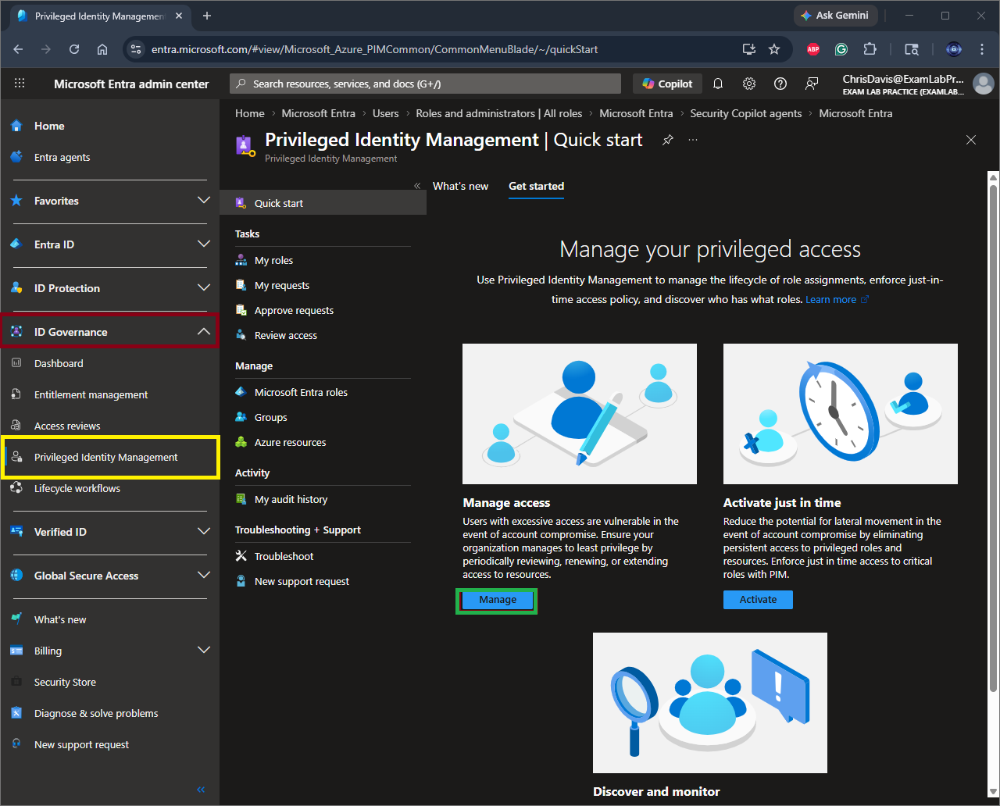
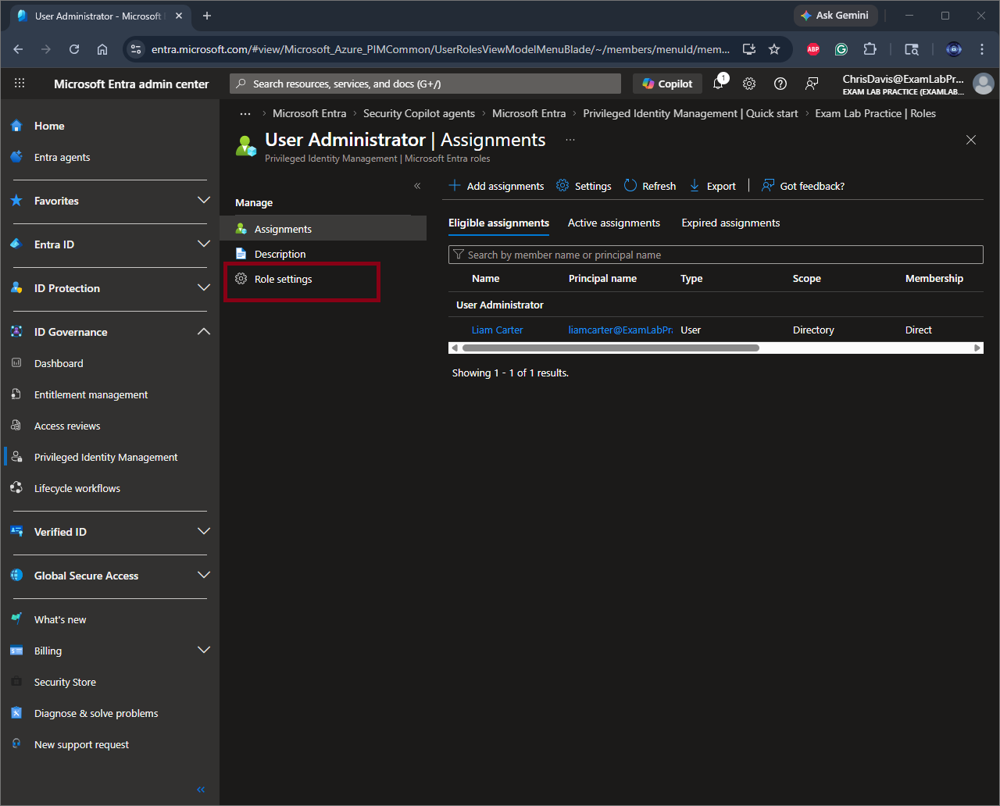
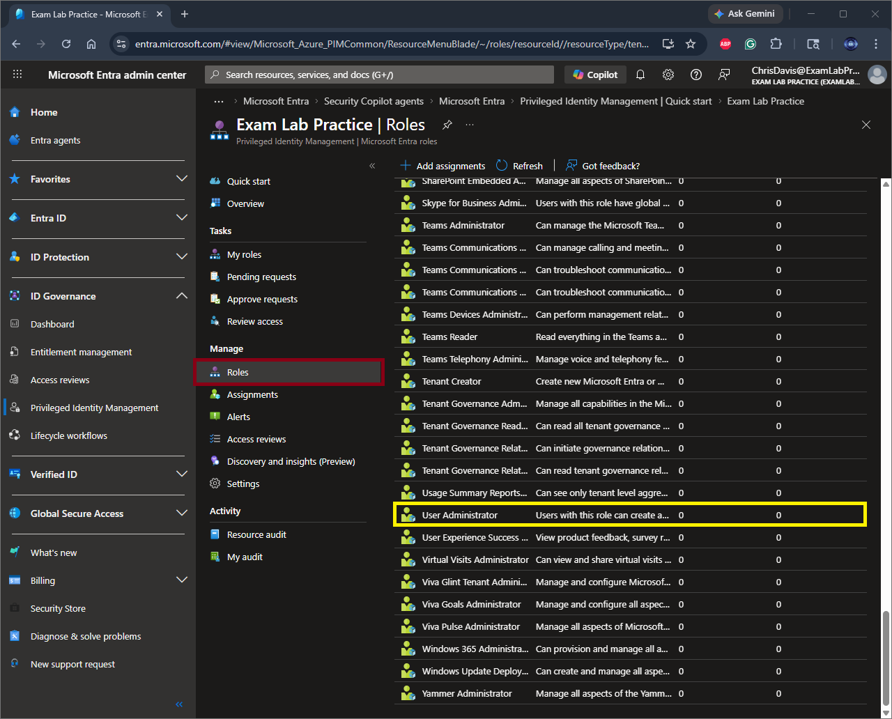
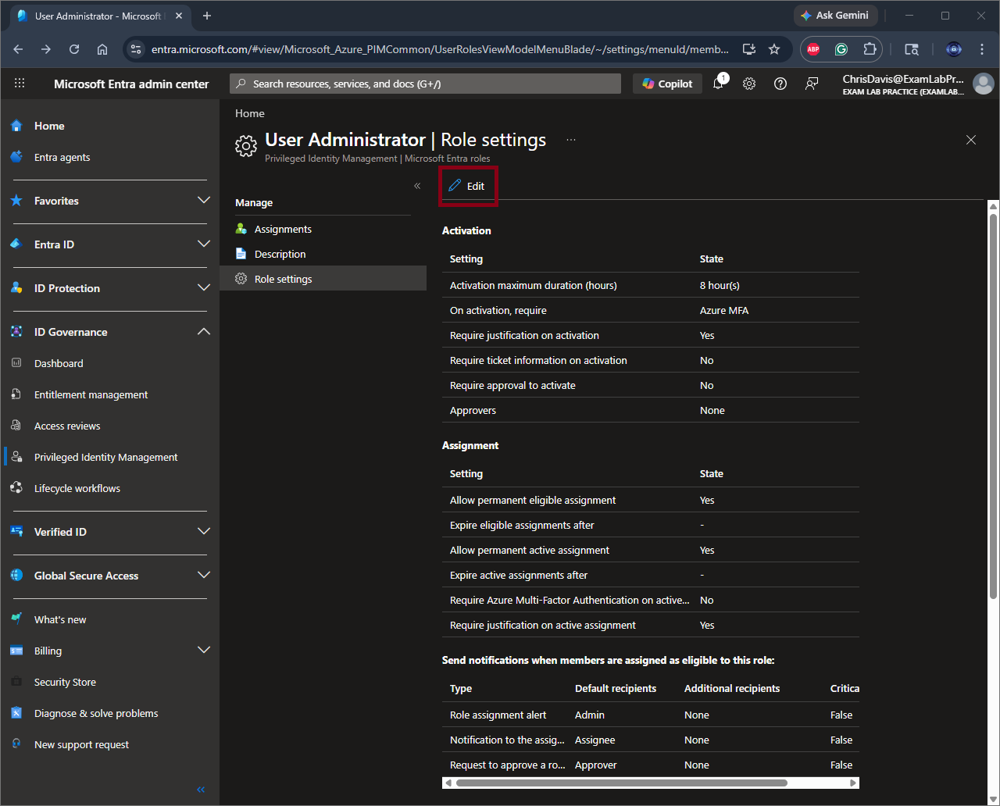
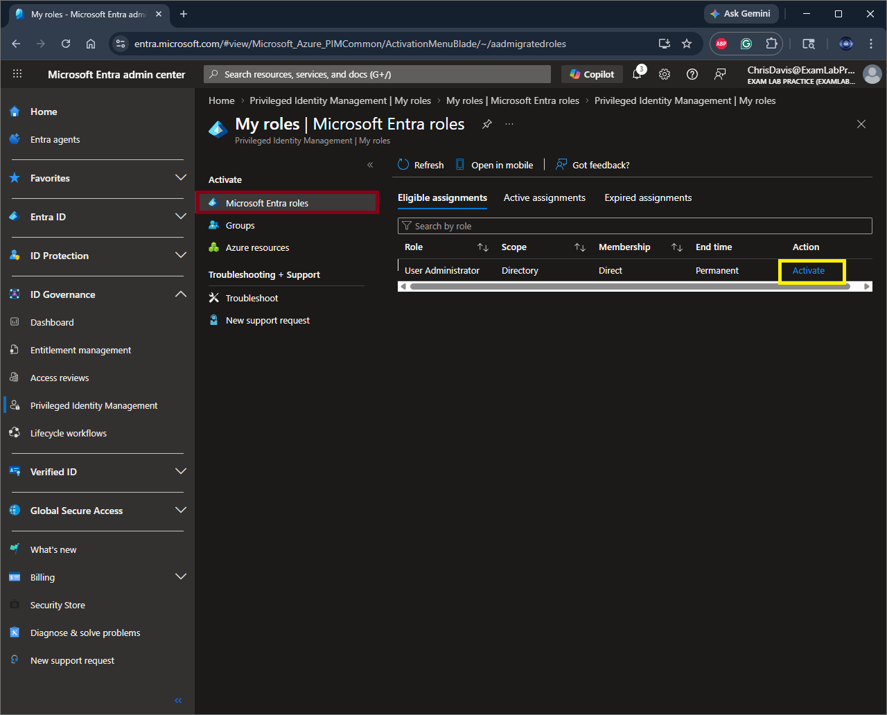
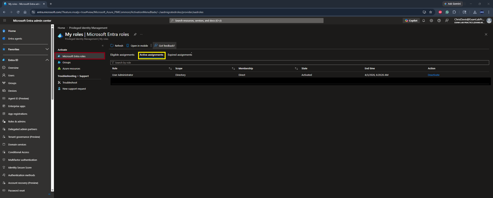
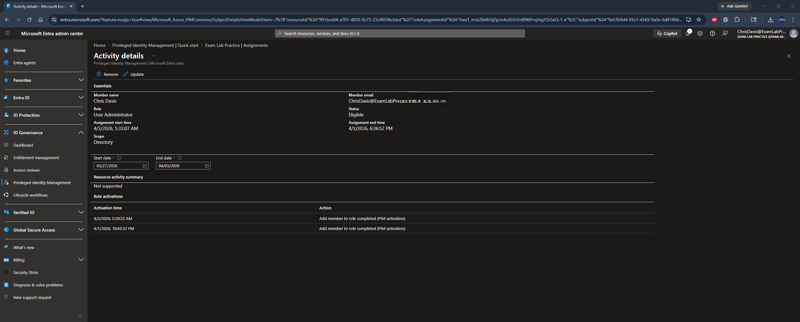

# PIM-Implementation-Entra ID

Identity and Access Management (IAM) hands-on labs and security implementations

# 🔐 Privileged Identity Management (PIM) Implementation – Microsoft Entra ID

## 📌 Overview
This lab demonstrates the implementation of **Privileged Identity Management (PIM)** in Microsoft Entra ID to enforce **least privilege access**, **Just-in-Time (JIT) role activation**, and **privileged access governance**.

The goal is to eliminate standing administrative access and introduce controlled, auditable privilege elevation aligned with Zero Trust principles.

---

## 🎯 Objectives
- Configure eligible role assignments
- Enable Just-in-Time (JIT) role activation
- Enforce least privilege access
- Implement approval-based activation controls
- Capture audit logs for privileged activity

---

## 🏗️ Environment
- **Platform:** Microsoft Entra ID (P2 License)
- **User:** Test Account
- **Role:** User Administrator
- **Scope:** Directory

---

## ⚙️ Implementation Steps

### 1. Navigate to Privileged Identity Management
Accessed PIM through Microsoft Entra ID → Identity Governance.

---

### 2. Review Available Roles
Reviewed available administrative roles and selected **User Administrator**.

---

### 3. Initiate Role Assignment
Accessed role assignments and initiated a new privileged role assignment.

---

### 4. Configure Eligible Assignment
Assigned the role as **Eligible** to enforce Just-in-Time activation instead of permanent access.

---

### 5. Review Default Role Settings
Reviewed baseline role configuration prior to applying governance controls.

---

### 6. Configure Governance Controls
Updated role settings to enforce:
- Multi-Factor Authentication (MFA)
- Justification requirement
- Approval workflow
- Time-bound activation (limited duration)

---

### 7. Request Role Activation (JIT)
Initiated role activation from **My Roles**, triggering Just-in-Time elevation.

---

### 8. Validate Successful Activation
Confirmed successful activation through system validation checks.

---

### 9. Verify Active Role Assignment
Validated that the role transitioned from **Eligible → Active**.

---

### 10. Review Audit Logs (Traceability)
Captured audit logs showing:
- Role activation event
- User identity
- Timestamp
- Action performed

---

## 🔍 Key Security Benefits
- Eliminates permanent administrative access
- Reduces attack surface and lateral movement risk
- Enforces Zero Trust access controls
- Provides full auditability of privileged actions
- Prevents privilege creep through time-bound access

---

## ⚠️ Lessons Learned
- Misconfigured approval workflows can block role activation
- Activation duration must align with policy requirements
- MFA enforcement is critical for privileged roles
- Always maintain **break-glass accounts** for emergency access
- Audit logs are essential for compliance and incident response

---

## 🧠 Real-World Application
In enterprise environments, PIM is used to:
- Enforce least privilege access across cloud environments
- Provide temporary administrative access for IT operations
- Support compliance frameworks (SOC 2, ISO 27001, NIST 800-53)
- Monitor and audit privileged account activity
- Strengthen identity-based security posture in Zero Trust architectures

---

## 📎 Author
**Chris Davis**  
Cloud IAM | Governance, Risk & Compliance (GRC) | Zero Trust Security
